#**Behavioral Cloning** 

The goals / steps of this project are the following:
* Use the simulator to collect data of good driving behavior
* Build, a convolution neural network in Keras that predicts steering angles from images
* Train and validate the model with a training and validation set
* Test that the model successfully drives around track one without leaving the road
* Summarize the results with a written report


## Rubric Points
###Here I will consider the [rubric points](https://review.udacity.com/#!/rubrics/432/view) individually and describe how I addressed each point in my implementation.  

---
###Files Submitted & Code Quality

####1. Submission includes all required files and can be used to run the simulator in autonomous mode

My project includes the following files:

| <center>File</center>			|    <center>Description</center>	        	| 
|:---------------------:|:---------------------------------------------:| 
| model.py  | Python file to train the model  					| 
| drive.py    	| Python file to run the file with simulator		|
| preprocess_images.py	| Python file to pre-process all images		|
| analyse_dataset.ipynb 		| Notebook where i Analysed and verified methods |
| model.h5		| main model (works ok on both track (run1.mp4 and (run2.mp4)	)						|
| model1.h5		| model (works best on track 1 					|
| model2.h5		| model (works best on track 2 (unseen) (run4.mp4)				|
| readme.md    | This file! 				|
| run1.mp4    | Track1 video				|
| run2.mp4   | Track2 video			|
| run4.mp4   | Track2 video	(unseen)		|


####2. Submission includes functional code
Using the Udacity provided simulator and my drive.py file, the car can be driven autonomously around the track by executing 
```sh
python drive.py model.h5
```


###Model Architecture and Training Strategy

####1. An appropriate model architecture has been employed

My model consists of a convolution neural network that I based on the Nvidia network but added dropout in the fully connected layers (model.py lines 183-203) 

The model includes RELU layers to introduce nonlinearity , and the data is normalized in the model using a Keras lambda layer as shown in the lecture. 
(I first used relu, tried to change to ELU (which is similar but don't have the Vanishing gradient problem) after people talking about it in the slack channel, 
didn't really notice any difference, so ended up with relu in the final model)

####2. Attempts to reduce overfitting in the model

The model contains dropout layers in the fully connected layers in order to reduce overfitting.
I also augment data in the generator, so should "never" be the same image more than once, or at least low probability. I do this by changing brightness/darkness and slightly change the color etc.

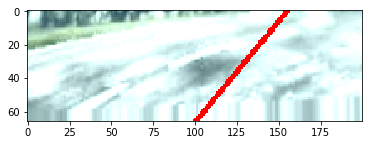

Also doing some warping that includes zoom, move and skew. while doing this I also change the angle to move with the image so it's still "correct" angle, as can be seen below:

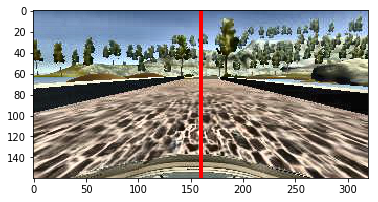
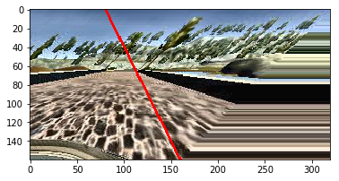

I also tried a method of use dropout in the images, I did that by randomly choosing a few rectangles for each channel that I put to 0, the idea with this is that even if for example half the image in gone, it should still know how to turn, or if one of the channels is lost in important areas. Here's two examples, the first one alot of data is lost, and the second not as much, ofcourse there's also cases where there's no dropouts

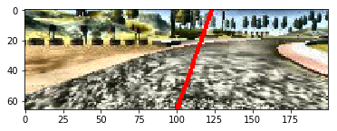
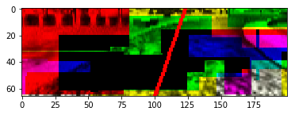

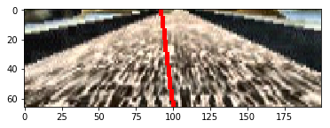
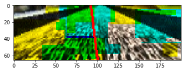


####3. Model parameter tuning

The model used an adam optimizer, so the learning rate was not tuned manually.

####4. Appropriate training data

First I used only the data given by udacity, with that I manage to go around the first track.
but I wanted it to be better so added driving in opposite direction for both tracks, as I wanted the correct direction on the second track to be unseen.

For details about how I created the training data, see the next section. 

###Model Architecture and Training Strategy

####1. Solution Design Approach


My first step was to use a convolution neural network model similar to the one by NVIDIA, I thought this model might be appropriate because they used it for a car, and it looks to be complex enough but still simple to be able to run in real time.

In order to gauge how well the model was working, I split my image and steering angle data randomly into a training and validation set. One idea I had, but never fully tried out was to use different set for the validation, the idea is that when just splitting, it's a big chance that each validation data will be very similar to the training, for example one image in the validation has the previous image in the training, so both the image and value is almost the same, but by using another dataset we can get a better estimate on the loss and see if it can do unseen data.

At first I did really well on track 1, and could do high speed and always staying in the middle, however, when I worked towards also be able to do track 2 it started to turn much more, and even in
the final model it can make several laps, but a small chance of going off the road. 

I also tried track 2 in the early simulator (version 1) the network had never seen this but made it all the way surprisingly well the first time I tried it.
However, in the newest version of the simulator, there's a new harder track that I didn't manage to go all the way around. but could go pretty far before crashing. This could of course be done by add this track to the training data, but that's not as fun.

At the end of the process, the vehicle is able to drive autonomously around the track without leaving the road. (in the final version, at least most of the time.)

####2. Final Model Architecture

The final model architecture is similar to NVIDIA model, but a few changes:

|          Layers           |
|:-----------------------------------------------:| 
| Image normalization
| Convolution 5x5, 24 filters, 2x2 strides , RELU activation
| MaxPooling  2x2
| Dropout 0.5
| Convolution 5x5, 36 filters, RELU activation
| Convolution 3x3, 48 filters, 2x2 strides , RELU activation
| Convolution 3x3, 64 filters, RELU activation 
| Convolution 3x3, 64 filters, RELU activation
| Fully connected 100 
| Dropout 0.5
| Fully connected 50 
| Dropout 0.5
| Fully connected 10 
| Dropout 0.5
| Fully connected 1 

####3. Creation of the Training Set & Training Process

To capture good driving behavior, I first used the data given by udacity, then I went in the opposite direction to get a 
"new" track. After this I went to the second track and went only in the opposite direction, i did this 3 times, one with
 "shortest" where i drove straight in S-curves etc, and then one for each lane. 

I never did a few random "recovery" just so it maybe can handle a few situation where it gets a bit off. I never "fine tuned" 
the run by doing extra data in hard situation, as I see that as a bit of cheating, as we should be as general as possible.

Here I had 26029 data points and the histogram of this looks like following:

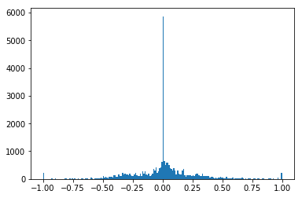

We can see that it's heavily biased towards 0, which is not the best.
one way to get more data with angles was to use all 3 cameras as in the lecture, where I added +- 0.2 for the angles to make 
it as "recover" data. I also flipped all the images, so I thereby got the double amount of data and to not over fit for one direction. This gave us 156174 data points

After this the histogram looked like this:

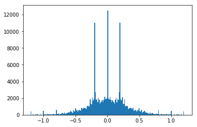

Still a bit biased to go straight...

I saw other students just cut of some data, but I tried to also make the model use more of the data on the sides, so using this part:

The histogram now looks like this! Really nice!!

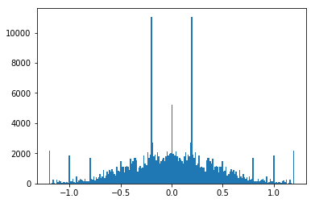

But wait! Now the car start to go all over the road and almost always turn!! so Maybe it's a bad idea to cut of data, as
 the data actually do represent how the car should go, which is mostly with no turning, and also if we remove some areas 
 where we go straight the car won't understand that and will thus turn, so lets add that back but also add more on the sides,
 
  now we have 256850 data points and the following histogram:

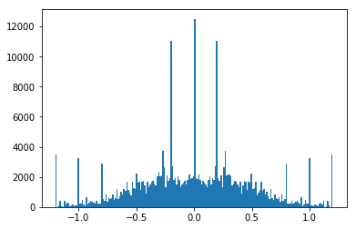

I finally randomly shuffled the data set and put 20% of the data into a validation set. 

I used this training data for training the model. The validation set helped determine if the model was over or under fitting, 
but wasn't perfect as it was very similar to the training data, and a model with very good validation score could perform 
worse on the real track, this showed that we also overfitted to the validation data!
One good idea to solve this would be to build a new simulator, that ran the same thing in high speed without showing it, 
and give us a validation score based on how well it performed.

I didn't find any "optimal" amount of epochs as it seemed to be different each time, but I ended up running 5 times.

Moreover, to be able to train faster, I did some pre-processing, such as resize, crop and apply CLAHE before and used these 
images instead. This is in the file Preprocess_images.py.

In the end I did do training data for track 2 aswell, which is model.h5. (the histogram and number of datapoints was
made for model1.h5, so model.h5 was trained on much more than that, but should be similar). However, it didn't go all the 
way and crashed after a while.